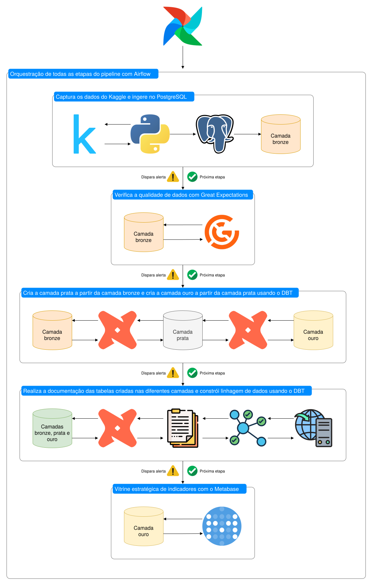
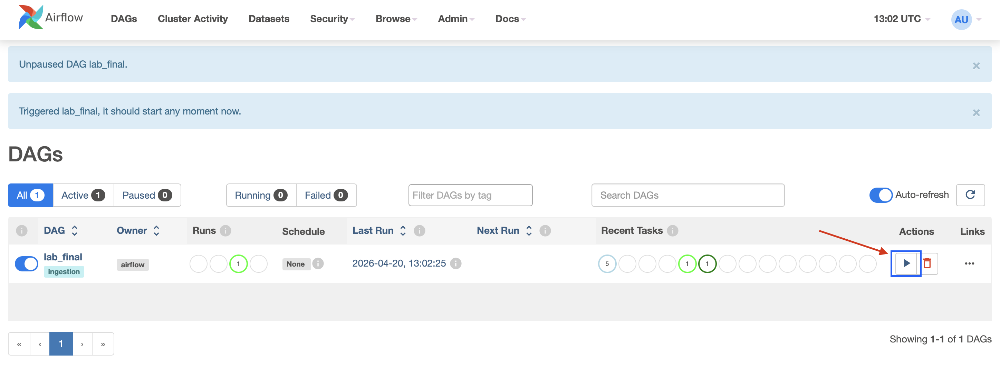
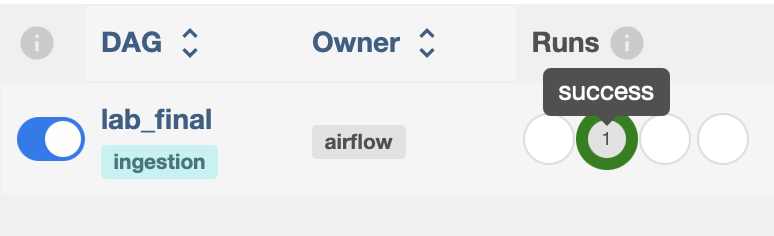
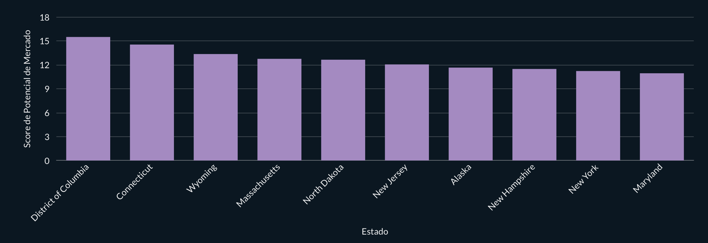
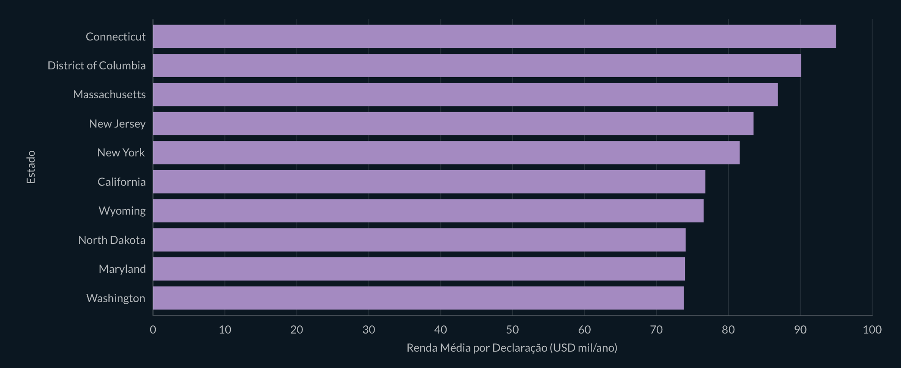
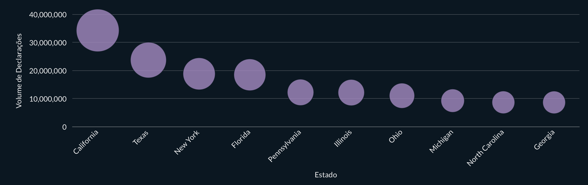
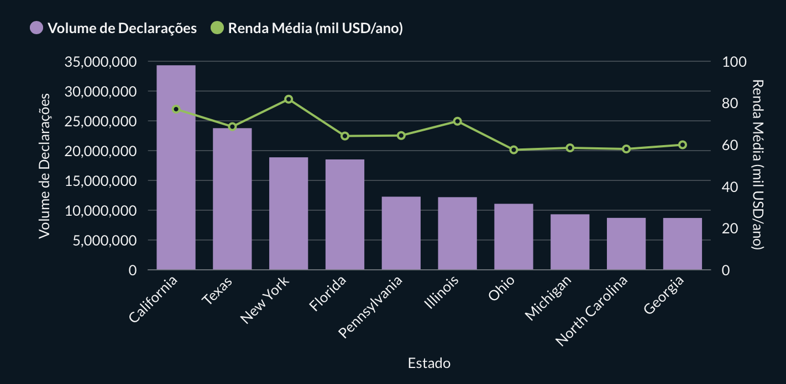
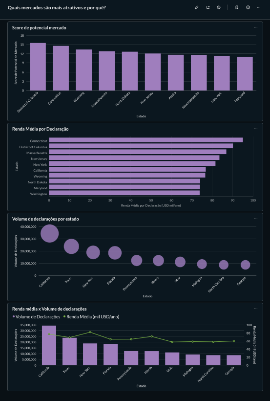

# 📚 Simulação de um Pipeline de Dados em Produção

### 🌱 Contexto

Uma empresa de atuação nacional busca expandir sua presença no mercado e tornar suas estratégias comerciais mais eficientes. Para isso, precisa entender de forma estruturada como o poder de compra está distribuído entre diferentes regiões e perfis da população.

Atualmente, decisões de expansão, investimento e marketing são frequentemente baseadas em dados fragmentados e pouco estruturados, sem uma visão integrada de fatores essenciais como renda, volume populacional e diferenças regionais de consumo. Essa limitação dificulta a identificação de oportunidades reais de mercado e pode levar a alocações ineficientes de recursos, campanhas pouco assertivas e perda de potencial competitivo.

Diante desse cenário, surge a necessidade de consolidar e organizar os dados de forma analítica, permitindo uma visão clara e comparável entre regiões.

### 💼 Problema de Negócio

A ausência de uma análise integrada entre renda e densidade populacional impede responder, com precisão, perguntas fundamentais como:

- Onde estão concentrados os maiores volumes de consumidores?
- Quais regiões apresentam maior renda média?
- Existe relação entre volume populacional e poder de compra?
- Quais regiões combinam alto volume populacional com renda relevante?
- Onde estão as melhores oportunidades para expansão de mercado?

Sem essas respostas, decisões estratégicas são tomadas com baixa eficiência, aumentando o risco de investimentos mal direcionados.

### 🎯 Objetivo

Este projeto tem como objetivo construir um pipeline de dados e uma camada analítica que permita identificar regiões com maior potencial econômico, combinando renda e volume populacional. A proposta é transformar dados brutos em informações estruturadas, capazes de apoiar decisões estratégicas de negócio. Por fim, propomos responder a seguinte pergunta: **onde estão os mercados com maior potencial de consumo?**

### 📊 Abordagem Analítica

Para responder a essa pergunta, o projeto utiliza uma modelagem dimensional que permite analisar os dados sob diferentes perspectivas:

- Dimensão geográfica (estado e região)
- Faixas de renda da população
- Volume de consumidores por faixa de renda
- Indicadores agregados por estado

A partir dessa estrutura, são construídos indicadores como:

- Renda média por indivíduo
- Volume total de renda por região
- Taxa efetiva de tributação
- Indicadores combinados de renda e população

Um dos principais outputs do projeto é um índice de potencial de mercado, que combina renda média com volume populacional ajustado (log da população), evitando distorções causadas por estados muito populosos. :contentReference[oaicite:0]{index=0}

### 📌 Resultado Esperado

Ao final, o projeto permite:

- Comparar estados de forma padronizada
- Identificar regiões com maior potencial econômico
- Apoiar decisões de expansão, investimento e marketing
- Melhorar a eficiência na alocação de recursos

Mais do que gerar dashboards, o objetivo é transformar dados em direcionamento estratégico.

### ✅️ Qualidade de Dados 

Validações aplicadas sobre o schema **raw** usando Great Expectations.

#### 1. Schema: colunas esperadas
Verifica que todas as 120 colunas do dataset estão presentes. Se uma coluna estiver ausente, a validação falha antes de chegar nos demais testes.

#### 2. Não nulos
Colunas `statefips`, `state`, `zipcode`, `agi_stub`, `year` não podem ser nulas.

#### 3. Valores válidos
| Coluna | Regra |
|---|---|
| `statefips` | Código FIPS entre `01` e `56` |
| `state` | Uma das 51 siglas: AL, AK, AZ, AR, CA, CO, CT, DE, FL, GA, HI, ID, IL, IN, IA, KS, KY, LA, ME, MD, MA, MI, MN, MS, MO, MT, NE, NV, NH, NJ, NM, NY, NC, ND, OH, OK, OR, PA, RI, SC, SD, TN, TX, UT, VT, VA, WA, WV, WI, WY, DC |
| `agi_stub` | Apenas `1, 2, 3, 4, 5, 6` |
| `year` | Apenas `2014` |
| `zipcode` | 5 dígitos numéricos |

#### 4. Contagens (`N*`) >= 0
Colunas `N*` contam quantas declarações reportaram determinado item (salário, dividendo, crédito etc.). Contagem de pessoas nunca pode ser negativa — 63 colunas validadas.

#### 5. Valores monetários (`A*`) >= 0
51 colunas de totais em dólares validadas com `min_value=0`. Exceções permitidas pois representam resultado líquido, que pode ser negativo em caso de prejuízo: `a00900` (negócio), `a01000` (capital), `a26270` (sociedades/S-corp).

#### 6. Volume do dataset
Entre **100.000** e **200.000** linhas.

**Total: 245 expectations** | Checkpoint: `irs_income_tax_checkpoint`

### 🧭 Diagrama de Arquitetura

### ⚙️ Execução do Projeto

Siga os passos abaixo para clonar e executar a pipeline completa em ambiente local.

#### 1. Clonar o repositório

Acesse o endereço `https://github.com/leonardosantosrocha/usp-fed-complete-data-pipeline/tree/main`, clique no botão `<> Code` (destacado em verde), selecione a opção `HTTPS` e clique no ícone de copiar. Em seguida, com o `git` pré-configurado, digite o comando `git clone https://github.com/leonardosantosrocha/usp-fed-complete-data-pipeline.git` para clonar o repositório e, por fim, `cd usp-fed-complete-data-pipeline` para entrar no diretório do repositório clonado.

#### 2. Passo obrigatório para usuários de sistemas derivados do Unix

Durante o desenvolvimento do projeto, o Airflow apresentou erros de permissão ao tentar interagir com o filesystem dos desenvolvedores, portanto, sugerimos que executem o comando `chmod -R 777 airflow/plugins app/data` após clonar o repositório, dessa forma, os diretórios `airflow/plugins` e `app/data` poderão ser acessados pelo Airflow durante a execução do projeto.

#### 3. Configuração do ambiente

Abra o arquivo `.env.example`, copie seu conteúdo e crie um novo arquivo chamado `.env` com o mesmo conteúdo. O arquivo `.env` original não está versionado por boas práticas de segurança, já que pode conter credenciais. Como este projeto tem caráter acadêmico e demonstrativo, as credenciais não são obrigatórias, permitindo a execução sem configurações adicionais. Após criar o arquivo, salve normalmente.

#### 4. Subir os serviços

No terminal, execute o comando `docker-compose up` para iniciar todos os serviços necessários para a execução da pipeline (irá levar alguns minutos).

#### 5. Acessar o Airflow

Abra no navegador e acesse `http://localhost:8080` e faça login com:
- Usuário: admin  
- Senha: admin

#### 6. Executar a pipeline

Após realizar o login na plataforma você verá a interface gráfica do Apache Airflow. Com isso, clique no ícone `play` para iniciar a execução da DAG.

#### 7. Acompanhar a execução

A execução será concluída quando, na seção `runs`, aparecer o indicador verde de sucesso - o que indica que o pipeline foi executado de ponta a ponta conforme o previsto.

#### 8. Acessar o dashboard

Após a conclusão da pipeline, acesse o dashboard através do endereço `http://localhost:3000/dashboard/2-quais-mercados-sao-mais-atrativos-e-por-que`

Utilize as credenciais abaixo para realizar o login:

- Usuário: camilafap02@gmail.com  
- Senha: poli-usp123  

Após a autenticação, será possível visualizar os gráficos apresentados neste projeto, que também estão detalhados nas seções abaixo.

### 🔎 Análise de Potencial de Mercado por Estado

Este projeto tem como objetivo identificar quais mercados são mais atrativos, considerando tanto o tamanho da base de consumidores quanto o seu poder de compra. 

A análise foi estruturada em diferentes visualizações, cada uma explorando uma dimensão específica do problema.

### 💸 Score de Potencial de Mercado

É um indicador que combina renda média (`avg_income_per_return`) com volume de consumidores (`total_returns`), ajustando o tamanho com log. 

Fórmula: <code>score = avg_income_per_return × log(total_returns)</code>

Dessa forma, evitamos que estados muito grandes dominem o ranking apenas por escala, trazendo uma visão mais equilibrada entre tamanho e capacidade de consumo.

### 💰 Renda Média por Declaração

É a média de renda das pessoas que declararam imposto em cada estado (`avg_income_per_return`), utilizada como proxy de poder de compra.

Fórmula: <code>avg_income_per_return = renda total declarada ÷ total_returns</code>

Os valores estão em milhares de dólares por ano e representam a renda média por contribuinte em cada estado.

### 📝 Volume de Declarações

É a quantidade de declarações de imposto por estado (`total_returns`), utilizada como proxy do tamanho do mercado consumidor.

Fórmula: <code>total_returns = número de declarações</code>

Esse indicador representa o volume de pessoas economicamente ativas em cada estado.

### 💲 Renda Média vs Volume de Mercado

É uma comparação entre o tamanho do mercado (`total_returns`) e o poder de compra médio (`avg_income_per_return`) por estado.

Essa visualização permite identificar:
- mercados grandes com menor poder de compra  
- mercados menores, porém mais ricos  
- e estados que conseguem equilibrar escala e renda  

A análise destaca o equilíbrio entre quantidade e qualidade do consumo, sem redundância de métricas derivadas.

### 📈 Dashboard Consolidado

Ao combinar todas as visualizações, o dashboard permite entender o potencial de mercado sob diferentes perspectivas complementares.

- O **score de mercado** sintetiza o equilíbrio entre escala e renda  
- A **renda média** mostra a qualidade do consumo  
- O **volume de declarações** evidencia o tamanho do mercado  
- A análise conjunta permite identificar como esses fatores se relacionam  

Essa abordagem evita decisões baseadas em apenas uma variável isolada.

Na prática, a análise mostra que:
- mercados maiores nem sempre possuem maior poder de compra  
- mercados mais ricos nem sempre possuem escala suficiente  
- os mercados mais atrativos são aqueles que equilibram essas duas dimensões  

### 💡 Conclusão

A identificação de oportunidades de mercado exige olhar simultaneamente para tamanho e capacidade de consumo.

Ao estruturar os dados dessa forma, é possível:
- priorizar mercados com maior retorno potencial  
- evitar decisões baseadas apenas em volume ou renda  
- e direcionar estratégias com maior embasamento analítico  

O dashboard, portanto, não apenas apresenta dados, mas apoia decisões mais estratégicas e fundamentadas.

### 📦 Artefatos Gerados

- 🎥 [Video demonstrativo](https://www.youtube.com/watch?v=Sjp65eyzPPk)

- 🎲 [Base de dados utilizada](https://www.kaggle.com/datasets/irs/individual-income-tax-statistics)

### 📋 Checklist de Tarefas e Contribuições

| Atividade | Engenheiro(a) responsável | Não concluído | Parcialmente | Concluído | Observação | 
| :-------: | :-------: | :-------: | :-------: | :-------: | :-------: | 
| Script Python p/ captura/ingestão |Leonardo|||🟢||
| Camada bronze no PostgreSQL |Leonardo/Ramon|||🟢||
| Qualidade de dados com GX |Gustavo|||🟢||
| Transformações/docs com DBT |Ramon|||🟢||
| Orquestração com Airflow |Gustavo/Leonardo|||🟢||
| Visualização com Metabase |Camila|||🟢||
| Uso de containers |Lucca|||🟢||

--- 